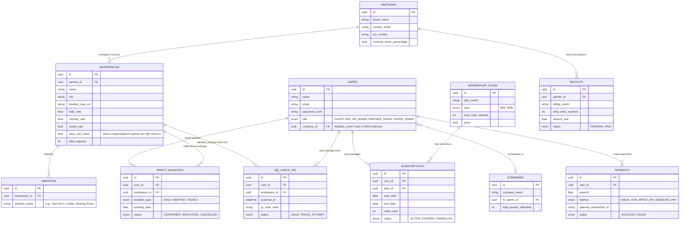

# Entity Relationship Diagram (ERD) - Master Version

This ERD encompasses the foundational booking logic (Waitlists, Durations) AND the massive Aggregator logic (B2B, Packages, QR Check-ins, Payouts).

