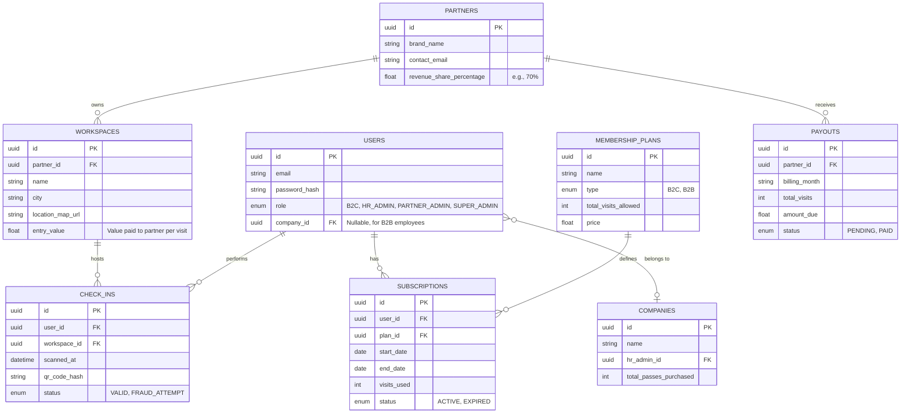

# مخطط قواعد البيانات (ERD) - نظام الـ Aggregator

```mermaid
erDiagram
    USERS {
        uuid id PK
        string email
        string password_hash
        enum role "B2C, HR_ADMIN, PARTNER_ADMIN, SUPER_ADMIN"
        uuid company_id FK "Nullable, for B2B employees"
    }

    COMPANIES {
        uuid id PK
        string name
        uuid hr_admin_id FK
        int total_passes_purchased
    }

    PARTNERS {
        uuid id PK
        string brand_name
        string contact_email
        float revenue_share_percentage "e.g., 70%"
    }

    WORKSPACES {
        uuid id PK
        uuid partner_id FK
        string name
        string city
        string location_map_url
        float entry_value "Value paid to partner per visit"
    }

    MEMBERSHIP_PLANS {
        uuid id PK
        string name
        enum type "B2C, B2B"
        int total_visits_allowed
        float price
    }

    SUBSCRIPTIONS {
        uuid id PK
        uuid user_id FK
        uuid plan_id FK
        date start_date
        date end_date
        int visits_used
        enum status "ACTIVE, EXPIRED"
    }

    CHECK_INS {
        uuid id PK
        uuid user_id FK
        uuid workspace_id FK
        datetime scanned_at
        string qr_code_hash
        enum status "VALID, FRAUD_ATTEMPT"
    }

    PAYOUTS {
        uuid id PK
        uuid partner_id FK
        string billing_month
        int total_visits
        float amount_due
        enum status "PENDING, PAID"
    }

    USERS ||--o{ SUBSCRIPTIONS : "has"
    USERS }o--o| COMPANIES : "belongs to"
    PARTNERS ||--o{ WORKSPACES : "owns"
    WORKSPACES ||--o{ CHECK_INS : "hosts"
    USERS ||--o{ CHECK_INS : "performs"
    PARTNERS ||--o{ PAYOUTS : "receives"
    MEMBERSHIP_PLANS ||--o{ SUBSCRIPTIONS : "defines"
```
